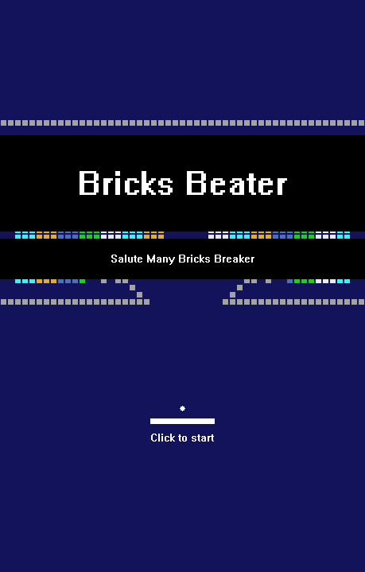

# BricksBeater——超级解压的打砖块游戏

## 简介

这可不是普通的打砖块游戏，这可是越打越上头的的打砖块游戏，玩起来很带劲~~还不快来试试。

复刻自 Steam 游戏 ManyBricksBeater（原游戏 Steam 售价 15￥）。

可以看此视频了解这个游戏：[打砖块，越玩压力越大！](https://www.bilibili.com/video/BV1hB4y1M7va/)

## 编译环境

Visual Studio 2022 & EasyX_20220901

## 下载地址

[下载 Windows x64 版本](https://github.com/zouhuidong/BricksBeater/releases/)

## 游戏截图

 

 

 

## 想自制关卡？

这得用文本编辑器手动画！我暂时没做工具。

如果真的想做，可以参考 ./res/level/ 内的关卡文件（关卡文件 level_xxx.dat 直接用文本编辑器打开即可），以及项目目录下的 readme.txt。关卡地图就是以字符画的形式存储的，相信你一看就知道该怎么做了。

注意，所有关卡地图的长宽必须一致，它们定义在 ./BricksBeater.ini 中。如果新增了关卡，也要在 ./BricksBeater.ini 中修改关卡数。
